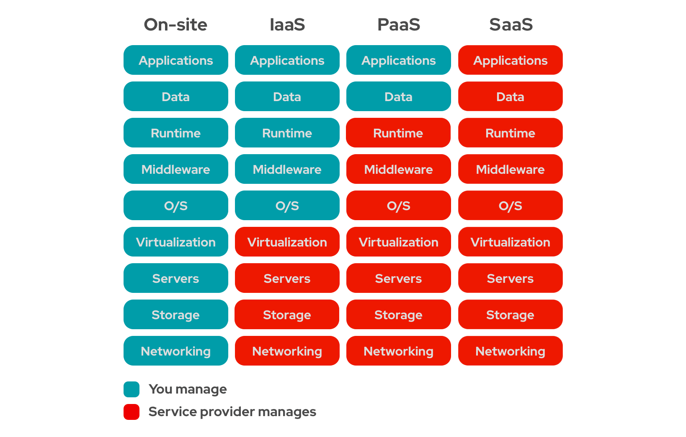

## Data centers locais
Quando falamos de infraestrutura antes de Cloud Computing, lembramos daquela sala cheia de raques com servidores e que dá 
muito trabalho para manter, pois é necessário de mão de obra especializada, ambiente com ar condicionado sempre ligado, e
muito difícil de escalar, pois a compra dos computadores não é necessáriamente por demanda, ou seja, pode ter mais computadores do que
se usa ou comprar a quantidade de computadores erradas, que seja necessário comprar novamente.

Nesse medelo mais antigo, vemos bastante burocracia para montar uma infraestrutura necessária.

## Benefícios do Cloud Computing
1- Velocidade -> Subir soluções em segundos  
2- Updates -> AWS faz updates sem interromper o serviço utilizado  
3- Custo -> Baixo, e sob demanda. Além de ser sob demanda, há vários planos de acordo com o perfil de uso  
4- Data Security -> AWS possui serviços que possuem segurança de dados e redundância  
5- Escalabilidade e elasticidade -> Caso sua aplicação esteja com a demanda alta, a AWS tem automações que sob instancias 
ou reduz instancias para se adaptar a situação.  

## Tipos de Serviços de Cloud
- IaaS -> Infrastructure-as-a-Service   
- PaaS -> Platform-as-a-Service  
- Saas -> Software-as-a-Service  

obs: Sempre que possui um "as-a" ou "como serviço" se trata de serviço de Cloud Computing que sua empresa possa se concentrar no que realmente importa,
no código e relacionamento com clientes.

A imagem abaixo resume bem as responsabilidades entre o provedor de Cloud e o Usuário, onde

<b>Exemplos de serviços para cada categoria</b>   
IaaS: <b>EC2</b>.  
A Amazon disponibiliza uma infraestrutura (como armazenamento e virtualização), mas o usuário ainda tem as responsabilidades descritas na tabela acima, ou seja,
como usuário, você é responsável pelo sistema operacional e todos os dados, aplicações, componentes de middleware e ambientes de
execução. No entanto, o provedor dos serviçoes gerencia e concede à sua empresa o acessoa a rede, servidores e recursos de virtualização
e armazenamento necessários.

PaaS: <b>APP Engine, Beanstalk</b>.  
A Amazon disponibiliza o ambiente de desenvolvimento e implantação.

SaaS: <b>Office 365, Google Docs, Gmail, etc</b>.
Fornece uma aplicação inteira que é gerenciada pelo próprio provedor e acessada via navegador web.
Atualizações, correções de bugs e outra tarefas gerais de manutenção do software são realizadas pelo provedor.

## Tipos de Cloud
- Public Cloud
- Private Cloud
- Hybrid Cloud

obs: todas as Clouds são datacenters interligados

<b>Public Cloud:</b>  
- Serviços de Cloud oferecidos por terceiros (provedor) que atende diversas empresas
- Disponível para qualquer um através da internet
- Escala rápido quando necessário
- Pay as you go (paga apenas pelo que você usa)

<b>Private Cloud:</b>  
- Configurada para atender as demandas de uma única empresa
- Também pode ser disponibilizado por terceiros, mas a infraestrutura terá um espaço privado, não dividindo espaço com outros
clientes do provedor Cloud.
- Custo maior.
- Maior segurança de dados
- Requer equipe tradicional para manutenção de datacenter, pois é gerenciado pelo usuário

<b>Hybrid Cloud:</b>
- Combinação de Public com Private
- Uma parte é privada, disponível apenas para uma empresa, mas contém outra parte que é pública
- Compartilha responsabilidades de manter a segurança
- Contém o benefício de escalar rápido

<b>Community Cloud</b>  